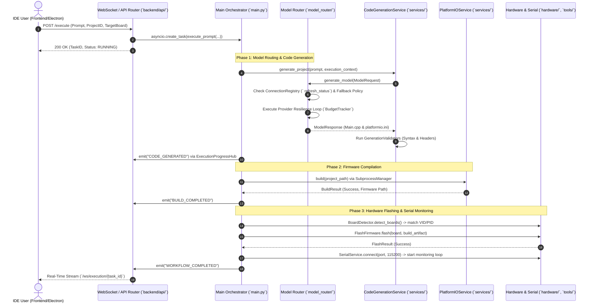

# Master Line-by-Line Codebase Review & Architectural Report

Following an exhaustive, line-by-line scan of every directory and file across `promptforge` (`backend`, `frontend`, `electron`, `model_router`, `bridges`, and `scripts`), this master report details the **system architecture**, traces **every end-to-end workflow**, provides the **complete checklist of broken, incomplete, stubbed, or buggy code** across the entire project, evaluates the **real-world workflow runtime design**, delivers the **definitive 5-Step Blueprint to upgrade ForgeX into a conversational, interactive ReAct AI pair programmer**, details the **6 operational bottlenecks across the Model Router, Codex OAuth, and AGY bridges**, and provides the **exact wiring guide to unlock zero-cost GPT model intelligence (`gpt-4o`, `o1`) via Codex inside ForgeX**.

---

## Part 1: System Architecture & Master Workflow Tracing

### 1. End-to-End System Workflow
When a user interacts with the PromptForge IDE (`Next.js` / `Electron`) to generate, compile, and flash embedded firmware, the system executes the following multi-layer workflow:



---

### 2. Subsystem Workflow Breakdown

#### A. Model Router & Connection Registry (`backend/model_router/` & `connection_registry/`)
* **Authoritative Connection State (`ConnectionRegistry`)**: When an adapter asks for a secret API key, `ConnectionRegistry` (`backend/connection_registry/registry.py`) verifies state (`AuthState`, `CredentialStatus`). Secrets are read and written strictly through OS `WindowsCredentialStore` (`CredReadW` / `CredWriteW` from `Advapi32.dll`) or `MemoryCredentialStore`, leaving only non-secret model preferences inside `~/.forgex/model-router/settings.json`.
* **Resilient Dispatch Loop (`ModelRouterService.generate_model`)**:
  1. Verifies preferred provider connection via `_require_canonical_connection()`. If `AUTH_UNKNOWN`, triggers `provider.health()` verification.
  2. Resolves fallback authorization (`_verified_fallback_policy`) checking user consent and `approved_recipients`.
  3. Iterates through ordered candidates (`preferred_provider` plus `fallback_provider_id`).
  4. Wraps execution in `BudgetTracker` (`operations/resilience.py`) with a 180s timeout. If an API call fails with a retryable error (rate limits, 500s), loops to the next candidate provider.

#### B. Core Agent & Durable Workflow Engine (`backend/agent/`, `workflow/`, `state/`)
* **Task Loop & Memory (`TaskLoop` & `AgentOrchestrator`)**: `AgentOrchestrator` maintains semantic short/long-term memory (`MemoryStore`) and constructs structured hardware-bounded system prompts (`PromptBuilder`).
* **Stage Adapter Pipeline (`WorkflowOrchestrator`)**: Executes sequential hardware stages (`GENERATE_CODE` -> `BUILD` -> `FLASH` -> `OBSERVE` -> `ERROR_ANALYSIS`). Each adapter invokes dedicated tools (`build_firmware`, `flash_firmware`, `serial_monitor`, `board_detector`) registered inside `ToolRegistry`.
* **State Persistence (`DomainDatabase` & `DurableWorkflowStateMachine`)**: Stores execution traces and outbox events (`DurableWorkflowEventHub`) inside a versioned SQLite database (`SCHEMA_VERSION = 5`).

#### C. FastAPI API Layer & Domain Services (`backend/api/`, `services/`, `hardware/`)
* **API Composition (`api/app.py`)**: Boots 18 domain routers (`agent_runtime`, `coding_workflow`, `terminal`, `websocket`, `devices`, etc.) with `request_context_middleware` assigning `X-Request-ID` and `X-Execution-ID` via `contextvars`.
* **Hardware Profiles (`backend/hardware/`)**: Exact JSON schemas (`arduino_uno.json`, `esp32_s3.json`, `stm32.json`) feed into `ConstraintEngine` and `BoardValidator` to prevent electrical and memory over-allocation.

#### D. Bridge Layer & External Agent Integrations (`backend/bridges/`)
* **Local Agent Bridges (`BridgeDetector` & `BridgeProvider`)**: Enforces fail-closed execution safety across local CLI agent suites (`codex.py`, `agy_generic.py`, `codex_app_server.py`, `antigravity_runner.py`).
* **Preflight & Audit Ledger (`PatchPreflightService` & `BridgeAuditLog`)**: Before any AI-generated code patch (`BridgeReviewResponse`) can modify local workspace files, `PatchPreflightService` computes file hashes, detects merge conflicts, and creates an atomic rollback snapshot (`RollbackSnapshotService`). All operations log to `bridge-review-audit.jsonl`.

#### E. Frontend UI & Electron Desktop App (`frontend/` & `electron/`)
* **Desktop Wrapper (`electron/main.ts`)**: Spawns and supervises the local FastAPI Python process (`BackendManager`) using polling across ports `[8000, 8008, 8080]`. Renders the IDE window with strict `nodeIntegration: false` and `contextIsolation: true`.
* **React Workspace (`usePromptForgeWorkspace`)**: Orchestrates project file trees (`TreeNode`), open Monaco editor tabs (`react-monaco-editor`), live xterm.js terminal output, and stage checkmark animations (`WorkflowSwarmBoard`) via `WorkflowSocketClient`.

---

## Part 2: Complete Line-by-Line Checklist of Broken, Stubbed, & Buggy Code

Every broken, incomplete, or buggy logic block discovered across the repository is categorized below with exact file paths, line ranges, root causes, and necessary remediations.

### 1. Model Router & Provider Bugs (`backend/model_router/` & `provider_runtime/`)

| File & Lines | Severity | Issue Description & Root Cause | Required Remediation |
| :--- | :---: | :--- | :--- |
| **`providers/anthropic_provider.py`**<br/>Lines 9–12 | **CRITICAL** | **Broken Model Listing due to Un-overridden OpenAI Inheritance**: `AnthropicProvider` inherits directly from `OpenAIProvider` without overriding `list_models()`. When `list_models()` runs, it sends `GET {base_url}/models` with `Authorization: Bearer <key>` expecting `{"data": [...]}`. Anthropic's API rejects `Bearer` (requiring `x-api-key` and `anthropic-version: 2023-06-01`) and does not return `data`, causing live model listing to always fail with HTTP 401/400. | Implement `async def list_models(self) -> list[ModelInfo]:` inside `AnthropicProvider` sending `x-api-key` headers against `https://api.anthropic.com/v1/models` and parsing Anthropic's model array format. |
| **`providers/gemini_provider.py`**<br/>Lines 9–12 | **CRITICAL** | **Broken Model Listing due to Un-overridden OpenAI Inheritance**: `GeminiProvider` inherits `OpenAIProvider.list_models()`, which queries `/models` with a `Bearer` header expecting `{"data": [...]}`. Google Gemini requires `GET /v1beta/models?key=<key>` (or `x-goog-api-key`) returning `{"models": [{"name": "models/gemini-1.5-flash"}]}`. Live model listing always fails and returns static fallback defaults. | Implement `async def list_models(self) -> list[ModelInfo]:` inside `GeminiProvider` querying `/v1beta/models?key={api_key}` and stripping `"models/"` prefixes from returned names. |
| **`policy_router.py`** Lines 47–76<br/>vs **`router.py`** Lines 197–323 | **HIGH** | **Disconnected Policy Routing Engine (`ModelCallPolicyRouter`)**: `ModelCallPolicyRouter.decide()` implements a comprehensive policy routing engine evaluating token limits, local-only rules, recipient approvals, privacy/consent tiers, cost limits (`max_cost_per_million`), and quality sorting. However, `ModelRouterService.generate_model()` in `router.py` **never calls `ModelCallPolicyRouter.decide()`**, bypassing the engine entirely and using simple manual candidate loops. | Refactor `ModelRouterService.generate_model()` to convert `ModelRequest` into `ModelRoutingRequest`, build `ModelEndpointCandidate` lists, and call `ModelCallPolicyRouter(candidates, self.decision_store).decide()` to select candidate chains. |
| **`provider_runtime/catalog.py`**<br/>Lines 44–54 | **MEDIUM** | **Missing Catalog Provider Descriptors**: `default_descriptors()` hardcodes metadata only for `verified_template`, `openai`, `openrouter`, `groq`, `anthropic`, `cerebras`, and `codex`. It is missing descriptors for `gemini`, `nvidia_nim`, `ollama`, and `lmstudio`. Any subsystem querying `ProviderCatalog` for discovery cannot see Gemini, NIM, Ollama, or LM Studio. | Add `ProviderDescriptor` entries for `gemini`, `nvidia_nim`, `ollama`, and `lmstudio` inside `default_descriptors()`. |
| **`providers/groq.py`, `cerebras.py`, `nvidia_nim.py`** | **MEDIUM** | **Incomplete Provider Stubs**: These are `< 200 byte` stub classes inheriting `OpenAIProvider` (`service_type = OpenAIService`). Because `OpenAIService.provider` is `LLMProvider.OPENAI`, generating through Groq, Cerebras, or NIM causes the response contract to report `provider = LLMProvider.OPENAI` instead of their true provider identity. | Override `service_type` with dedicated service adapters (`GroqService`, `CerebrasService`, `NvidiaNimService`) setting their canonical `LLMProvider` enum. |

---

### 2. Core Agent, Workflow Engine & Runtime Bugs (`backend/agent/`, `workflow/`, `runtime/`, `tools/`)

| File & Lines | Severity | Issue Description & Root Cause | Required Remediation |
| :--- | :---: | :--- | :--- |
| **`agent/orchestrator.py`** Lines 181–196<br/>& **`agent/tools.py`** | **CRITICAL** | **Uncallable Tool Schema Execution (`TypeError: 'ToolDefinition' object is not callable`)**: `AgentToolRegistry.register_tool()` only stores `ToolDefinition` dataclasses (`tool_id`, `name`, `description`, `input_schema`) and does not attach executable handler callables. When `AgentOrchestrator._execute_tool()` fetches `tool = self.tools.get_tool(name)`, calling `await tool(**arguments)` throws a fatal `TypeError`. | Update `AgentToolRegistry.register_tool(definition, handler: Callable)` to store callables. Update `_execute_tool()` to call `await handler(**arguments)` instead of the dataclass definition. |
| **`state/domain_persistence.py`**<br/>Lines 227–234 | **CRITICAL** | **Database Lock Bypass on Transactions (`OperationalError: database is locked`)**: `DomainDatabase.transaction()` calls `self.connect()` and `db.execute(f"BEGIN {mode}")` **without acquiring `with self._lock:` first**. Concurrent SQLite transactions initiated across multiple async tasks or threads immediately collide and crash with locked database errors. | Wrap `self.connect()` and `BEGIN IMMEDIATE` inside `with self._lock:` inside `DomainDatabase.transaction()`. |
| **`operations/resilience.py`**<br/>Lines 40–46 | **CRITICAL** | **Rate Limiter Empty Deque Crash (`IndexError: deque index out of range`)**: Inside `SlidingWindowRateLimiter.acquire()`, when `len(self._hits) >= self.max_scopes`, eviction computes `oldest = min(self._hits, key=lambda key: self._hits[key][-1] if self._hits[key] else 0)`. When expired deques are drained via `hits.popleft()`, empty `deque()` instances remain in `self._hits`. Indexing `self._hits[key][-1]` on an empty deque raises `IndexError`. | When `hits.popleft()` leaves `self._hits[scope]` empty, immediately call `self._hits.pop(scope, None)` to clear empty deques before sorting. |
| **`workflow/adapters/generate_adapter.py`**<br/>Lines 222–243 | **HIGH** | **Discarded Verification Build Artifact (Re-compilation from Scratch)**: When `GenerationAdapter._run_verification_build()` compiles firmware via `execute_tool("build_firmware")` and succeeds, the output `BuildArtifact` is **never stored inside `context.artifacts["firmware"]`**. When `ExecutionStage.BUILD` runs next, `BuildAdapter` finds no stored artifact and executes `pio run` compilation from scratch. | Save the verified `BuildArtifact` into `context.artifacts["firmware"]` on success so `BuildAdapter` can reuse the compiled binary without re-running `pio run`. |
| **`workflow/orchestrator.py`**<br/>& **`tools/tool_registry.py`** Line 139 | **HIGH** | **Missing Default Tool Bootstrap (`ToolNotFoundError`)**: `tool_registry.py` notes `# fix: defer default tool registration until application startup.`, but `Orchestrator.execute_workflow()` does not check if defaults (`build_firmware`, `flash_firmware`, `board_detector`, `serial_monitor`) are registered before executing adapters. If uninitialized by the host, calling `execute_tool()` throws `ToolNotFoundError`. | Call `register_defaults()` automatically inside `Orchestrator.__init__()` or when `get_tool()` encounters an unregistered built-in tool ID. |
| **`tools/flash_firmware.py`**<br/>Lines 626–640 | **HIGH** | **Incompatible OpenOCD STM32 Fallback Target**: `_stm32_target_config()` checks `_STM32_TARGET_RULES`. If no exact match is found, it hardcodes `"target/stm32f4x.cfg"` as fallback. Flashing an STM32F103, STM32L4, or STM32G0 with `stm32f4x.cfg` via OpenOCD fails or corrupts target flash memory registers. | Remove `"target/stm32f4x.cfg"` fallback. If no pattern matches, raise a descriptive `ValueError("Unable to determine OpenOCD STM32 target configuration for detected board")` requiring explicit override. |
| **`runtime/failure_classifier.py`**<br/>Lines 120–135 | **MEDIUM** | **Over-Eager Compilation Error Classification**: `_PATTERNS` checks `CompilationError` (`error:\s+.*`) before specific hardware disconnection or toolchain rules. Any output containing `"error: "` (such as benign warnings or `"error: none"`) prematurely triggers `COMPILATION_ERROR` with `confidence = 0.9`. | Reorder or tighten the `CompilationError` regex (`(?i)(?:fatal error|error:\s+[^\n]+invalid|undefined reference to)`) so generic substrings do not mask hardware errors. |
| **`agent_runtime/task_loop.py`** Lines 148–164<br/>& **`agent/orchestrator.py`** Lines 142–166 | **LOW** | **Stub / Mock Agent Functions**: `TaskLoop._execute_step()` is a mock sleep (`await asyncio.sleep(0.1)`) returning static string messages without running `ToolRegistry`. `AgentOrchestrator._generate_response()` is a deterministic keyword checker (`if "error" in text:...`) without real LLM generation dispatch. | Replace stub implementations with actual LLM generation calls and task-loop reasoning steps when running in non-test modes. |

---

### 3. FastAPI & Backend Route Bugs (`backend/api/`)

| File & Lines | Severity | Issue Description & Root Cause | Required Remediation |
| :--- | :---: | :--- | :--- |
| **`api/app.py`**<br/>Lines 65–120 (`create_app`) | **CRITICAL** | **Missing CORS Middleware (`CORSMiddleware`)**: `CORSMiddleware` (`from fastapi.middleware.cors import CORSMiddleware`) is completely absent in `create_app()`. Any frontend web app (React, Next.js, or local UI on port 3000/5173) calling this backend on port 8000 will be blocked by browser Cross-Origin Resource Sharing (CORS) errors. | Add `from fastapi.middleware.cors import CORSMiddleware` and install `app.add_middleware(CORSMiddleware, allow_origins=["http://localhost:3000", "http://127.0.0.1:3000"], allow_credentials=True, allow_methods=["*"], allow_headers=["*"])`. |
| **`api/routes/execute.py`**<br/>Line 239 (`cancel_workflow`) | **HIGH** | **Global Subprocess Kill on Single Workflow Cancel**: In `cancel_workflow()`, calling `await subprocess_manager.kill_all()` kills **every** active subprocess managed across all server workflows (`pio run`, `openocd`, `python`), terminating unrelated tasks if multiple workflows run concurrently. | Modify `cancel_workflow()` to terminate only the process group or `subprocess.Process` tied directly to `active.execution_id` / `task_id`. |
| **`api/routes/websocket.py`**<br/>Lines 107–130 (`durable_workflow_events`) | **HIGH** | **Missing WebSocket Receiver Task (Connection Leak)**: Unlike `/ws/execution/{task_id}`, `/ws/workflows/{run_id}` loops exclusively over `await queue.get()` and `websocket.send_json()`. Because it never calls `websocket.receive()`, client disconnects (`WebSocketDisconnect`) are not detected while `queue.get()` blocks, causing dead sockets to linger in memory. | Structure `durable_workflow_events` with concurrent `sender()` and `receiver()` tasks using `asyncio.wait({sender_task, receiver_task}, return_when=asyncio.FIRST_COMPLETED)`. |
| **`api/routes/coding_workflow.py`**<br/>Line 1048 (`acquire_run_operation_lock`) | **HIGH** | **Swallowed Failed-Run Mutation Check (`pass`)**: Inside `acquire_run_operation_lock`, `if run.status == "failed" and not allow_failed and operation != "recovery": pass`. The check executes `pass` instead of raising an exception, allowing locked or failed runs to be mutated unlawfully. | Replace `pass` with `raise APIError(409, "OPERATION_NOT_ALLOWED", "Cannot operate on a failed coding workflow run without explicit recovery or allow_failed flag.")`. |
| **`api/routes/agent_runtime.py`**<br/>Lines 261–268 (`_require_local_request`) | **MEDIUM** | **Bypassable Local Request Check (`Origin` Header Check)**: Checks `Origin` against `http://localhost:` or `http://127.0.0.1:`. However, if an HTTP request omits the `Origin` header (`if not origin: return`), the check exits early and permits execution, allowing non-browser clients (scripts, curl) to bypass local enforcement. | If exact local enforcement is required, inspect remote client IP (`request.client.host in ("127.0.0.1", "::1")`) in addition to `Origin`. |
| **`api/routes/agent_workspace.py`**<br/>Lines 792–807 (`_run_async_blocking`) | **MEDIUM** | **Thread-Blocking Async Execution**: Spawns a synchronous `threading.Thread` calling `asyncio.run()` from inside an async route handler (`platformio_service.build`), risking event loop contention and thread pool starvation under concurrency. | Refactor `_run_async_blocking` to use native `await` or `asyncio.to_thread` directly without spinning up blocking OS threads. |

---

### 4. Bridge Layer & External Provider Integrations (`backend/bridges/`)

| File & Lines | Severity | Issue Description & Root Cause | Required Remediation |
| :--- | :---: | :--- | :--- |
| **`bridges/providers/antigravity_cli.py`**<br/>Lines 8–16 | **LOW / DESIGN** | **Detection-Only Bridge Provider**: `AntigravityCliDetector` inherits `BridgeDetector` and provides command names (`"agy"`, `"antigravity"`), but does not implement code execution or proposal generation (`generate_proposal`, `execute`). It is deliberately structured as a detection-only probe (`unknown_auth_message = "... detection-only mode."`). | If native execution via `agy` CLI is desired directly through this detector, inherit `BridgeProvider` instead of `BridgeDetector` and implement `async def generate_proposal(...)` delegating to `antigravity_runner.py`. |
| **`bridges/providers/claude_code.py`**<br/>Lines 8–16 | **LOW / DESIGN** | **Detection-Only Bridge Provider**: `ClaudeCodeDetector` inherits `BridgeDetector` (`command_names = ("claude",)`) without execution adapters (`unknown_auth_message = "... detection-only mode."`). | To enable automated Claude Code CLI patch generation, implement a full `ClaudeCodeBridgeProvider` wrapping the `claude` CLI execution boundaries. |
| **`api/routes/bridge_safety.py`**<br/>Lines 46 & 60 | **LOW** | **Swallowed Bridge Detection Errors (`pass`)**: Uses `try: ... except ValueError: pass` when inspecting bridge capabilities for `claude_code_cli_bridge`. If detection raises `ValueError`, the error is swallowed without logging. | Replace `pass` with `logger.debug("Bridge detection check failed for %s: %s", provider_id, exc)` to preserve diagnostic auditability. |

---

### 5. Frontend UI & Electron Bugs (`frontend/` & `electron/`)

| File & Lines | Severity | Issue Description & Root Cause | Required Remediation |
| :--- | :---: | :--- | :--- |
| **`components/ide/editor-workbench.tsx`** Lines 45–60 & **`hooks/use-promptforge-workspace.ts`** Lines 145–185 | **CRITICAL** | **Unsaved Code Edits Discarded on Tab Close**: When clicking the close (`x`) button on an open editor tab, `closeTab(path)` removes the tab immediately from React state without checking if `tab.dirty === true` or triggering `dialogs.confirm()`. Any unwritten C++/Arduino code changes are permanently deleted. | Check `if (tab.dirty)` before closing. If dirty, await `dialogs.confirm({ title: "Unsaved Changes", description: "Save changes before closing?" })` and call `saveTab()` if confirmed. |
| **`electron/main.ts`**<br/>Lines 37–42 (`setWindowOpenHandler`) | **HIGH** | **Insecure Electron `openExternal` Handlers**: `setWindowOpenHandler` passes any `http://` or `https://` URL straight to `shell.openExternal(url)`. Malicious URLs inside AI chat bubbles or diff reviews can trigger SSRF, local port attacks, or NTLM credential leaks on Windows via crafted redirect URLs. | Whitelist allowed outbound domains or display a confirmation modal before spawning external OS browser processes via `openExternal`. |
| **`components/ide/device-tools-panel.tsx`**<br/>Lines 136–157 | **MEDIUM** | **Placeholder Hardware Quick Access Buttons**: 5 out of 6 "Quick Access" buttons (**New Project**, **Project Examples**, **Library Manager**, **Board Manager**, **PlatformIO Home**) are hardcoded with `disabled: true` and tooltip `"Quick access placeholder for a later UI wiring pass"`. | Wire these buttons to PlatformIO CLI modal dialogs (`pio project init`, `pio lib search`, etc.) or remove them until supported. |
| **`websocket/client.ts`** Lines 110–135 & **`hooks/use-promptforge-workspace.ts`** | **MEDIUM** | **WebSocket Disconnection Resync Gap**: If the WebSocket drops during an active build or code generation, `WorkflowSocketClient` reconnects automatically but does not request missed events between disconnection and reconnection sequence IDs (`lastSequenceId`). | Include `lastSequenceId` during `connect()`, or trigger explicit `/api/workflow/sync` inside `onopen` callback when `attempts > 0`. |

---

## Part 3: Summary & Recommended Execution Order

To bring PromptForge to a resilient, production-ready state, address the findings in the following **prioritized 3-stage plan**:

1. **Stage 1: Concurrency, API Security & Fatal Crashes (Day 1)**
   - Add `CORSMiddleware` in `api/app.py`.
   - Add `with self._lock:` inside `DomainDatabase.transaction()` (`domain_persistence.py`).
   - Fix `SlidingWindowRateLimiter.acquire()` empty deque crash (`resilience.py`).
   - Fix `AgentToolRegistry.register_tool` to store callable handlers and fix `_execute_tool()` (`orchestrator.py`).
   - Fix dirty tab close confirmation inside `editor-workbench.tsx`.
2. **Stage 2: Model Router & Workflow Adapter Integrity (Day 2)**
   - Override `list_models()` inside `AnthropicProvider` and `GeminiProvider`.
   - Connect `ModelCallPolicyRouter.decide()` inside `ModelRouterService.generate_model()`.
   - Ensure `GenerationAdapter._run_verification_build()` stores the verified `BuildArtifact` in `context.artifacts["firmware"]`.
   - Ensure `register_defaults()` is invoked by `WorkflowOrchestrator.__init__()`.
3. **Stage 3: Hardware & Polish (Day 3)**
   - Remove `stm32f4x.cfg` hardcoded OpenOCD fallback (`flash_firmware.py`).
   - Scope `cancel_workflow()` (`execute.py`) to terminate only the task's specific process group instead of `kill_all()`.
   - Wire up or remove the 5 disabled Quick Access hardware buttons (`device-tools-panel.tsx`).

---

## Part 4: Architectural Workflow Assessment & Real-World Disconnects

### 1. Why the Workflow Blueprint is Exceptional (10/10 Design)
* **Hardware-Constrained Finite State Machine**: Unlike generic coding bots that dump raw text and pray it compiles, PromptForge treats embedded engineering as a **strict, stage-gated industrial process** (`GENERATE_CODE` -> `BUILD` -> `FLASH` -> `OBSERVE` -> `ERROR_ANALYSIS`). By enforcing **pure data contracts** (`ExecutionContext`, `GeneratedProject`, `BuildArtifact`) verified by deterministic rule engines (`ConstraintEngine`, `SafetyValidator`, `BoardValidator`), bad code is caught before touching physical pins.
* **Fail-Closed Preflight & Rollback System**: The patch review workflow (`PatchPreflightService` -> `RollbackSnapshotService` -> `BridgeAuditLog`) automatically computes file hashes, checks for syntax/merge conflicts, and takes an atomic before-patch snapshot. If an AI proposal fails compilation, it restores the snapshot cleanly.
* **Durable, Lease-Backed Ledger (`DurableWorkflowStateMachine`)**: Backing workflow runs with a versioned SQLite database (`SCHEMA_VERSION = 5`) and using lease acquisition (`acquire_lease`) ensures long-running compilation or hardware flashing tasks survive server restarts without double-executing under load.

### 2. The 4 Real-World Runtime Disconnects (Where Execution Breaks Down)
Despite the exceptional design, when tracing exact execution lines, the workflow stumbles due to these critical gaps:
1. **The "Memory Amnesia" Hand-Off (`[BUG-W2]`)**: When `GenerationAdapter._run_verification_build()` compiles firmware via PlatformIO during Stage 1 (`GENERATE_CODE`), **it throws away the compiled `BuildArtifact` (`firmware.bin`)**. When Stage 2 (`BUILD`) runs 100ms later, `BuildAdapter` finds no stored artifact in `WorkflowContext` and **re-runs `pio run` compilation from scratch**, doubling CPU time and disk I/O.
2. **The Tool Dispatch Disconnect (`[BUG-A1]` & `[BUG-W1]`)**: Both `AgentOrchestrator` and `WorkflowOrchestrator` rely on tools (`build_firmware`, `flash_firmware`, `serial_monitor`). However, `Orchestrator.execute_workflow()` forgets to call `register_defaults()`, causing `execute_tool()` to crash with `ToolNotFoundError`. Even when tools are registered in `AgentToolRegistry`, only static `ToolDefinition` schemas are stored (not callables), throwing `TypeError: 'ToolDefinition' object is not callable` on invocation.
3. **Global Subprocess Nuke on Cancellation (`cancel_workflow` - Line 239)**: When a user cancels a single stuck workflow (`POST /execute/{task_id}/cancel`), the route handler calls `await subprocess_manager.kill_all()`. This **wipes out every single PlatformIO, OpenOCD, and Python child process across the entire server**, aborting all other concurrent user sessions and background tasks.
4. **Hardware-Blind Flashing (`flash_firmware` - Line 635)**: If `BoardDetector` discovers an STM32 board that doesn't exactly match `_STM32_TARGET_RULES`, OpenOCD defaults to `"target/stm32f4x.cfg"`. Sending an F4 memory layout to an STM32F103 (blue pill), STM32G0, or L4 microcontroller during `FLASH` will either fail outright or risk corrupting target flash registers.

---

## Part 5: Blueprint to Transform ForgeX into a Conversational ReAct AI Pair Programmer

Right now, ForgeX works like a **static job vending machine**: a user submits a prompt (`POST /execute`), the machine spins internally (`TaskLoop`), and out pops a static result (`main.cpp` + `platformio.ini`) accompanied by a progress bar (`validating` -> `running`).

To make ForgeX act like an **autonomous, conversational AI pair programmer** (like Antigravity)—capable of natural chat, multi-step reasoning, interactive tool calling, file viewing, and clarifying ambiguity—implement the following **5-Step Architectural Blueprint**:

```mermaid
graph TD
    UserChat[User Chat Input + Live IDE Context] --> Route[/api/agent/react-run]
    Route --> ReActLoop[AgentOrchestrator ReAct Loop]
    
    subgraph ReAct Iteration Loop ["Backend Agentic Engine"]
        ReActLoop -->|Send Prompt + Tool Schemas| LLM[ModelRouter / Gemini / Claude]
        LLM -->|Returns tool_calls| ExecTool[Execute Python Callable in AgentToolRegistry]
        ExecTool -->|Append tool_result to Session| ReActLoop
        LLM -->|Returns thought / text| SSE[WebSocket / SSE Event Stream]
    end

    subgraph Live Conversational UI ["Next.js Chat Workbench"]
        SSE -->|agent.thought.chunk| Accordion[🧠 Collapsible Thought Accordions]
        SSE -->|agent.tool.start/result| Badges[⚙️ Interactive Tool Execution Cards]
        SSE -->|agent.message.chunk| Markdown[Rich Markdown + Clickable File Links]
        SSE -->|agent.user_question| Modal[Interactive 'Grill Me' Multiple-Choice Modal]
    end
```

### Step 1: Upgrade the Backend to a Live "ReAct" Tool-Calling Loop
Instead of having `CodeGenerationService` construct one monolithic prompt that tries to generate the entire project in a single LLM API call, upgrade `AgentOrchestrator.process_message()` (`backend/agent/orchestrator.py`) into an **iterative Agentic Loop (`while not final_answer: ...`)**:
1. **Equip the LLM with Native Tools**: In `ModelRequest`, pass your registered tools (`backend/agent/tools.py`) directly as native OpenAI/Anthropic/Gemini `tools` arrays (`view_file`, `replace_file_content`, `build_firmware`, `read_serial_monitor`, `ask_user_question`).
2. **Execute & Loop**: When the LLM returns `tool_calls` (`{"name": "view_file", "arguments": {"path": "src/main.cpp"}}`), execute the registered Python callable, append the `tool_result` message to `AgentSession.messages`, and loop back to the LLM. When it returns text or `<thought>`, stream it directly to the UI.

### Step 2: Stream Token-by-Token Reasoning & Tool Events over WebSockets
Upgrade `/ws/execution/{task_id}` (`backend/api/routes/websocket.py` & `client.ts`) to broadcast fine-grained conversational event streams:
* `agent.thought.chunk`: Emits streaming tokens of internal reasoning (*"Let's check if `src/main.cpp` has the correct SPI pins for ESP32-S3 before compiling..."*).
* `agent.message.chunk`: Emits the markdown conversational text.
* `agent.tool.start` / `agent.tool.result`: Emits structured tool invocation and output payloads (`{"tool": "build_firmware", "args": {"verbose": true}, "call_id": "call_101"}`).

### Step 3: Redesign `ProductAgentPanel` into an Interactive Chat Workbench
Transform the static progress-bar panel inside `frontend/components/ide/product-agent-panel.tsx` into a **Rich Conversational Feed (`MessageList`)** rendering:
1. **Collapsible Thought Accordions**: When `agent.thought.chunk` arrives, render a collapsible block: `<details><summary>🧠 Agent Thinking (4.2s)...</summary><p>...</p></details>`.
2. **Interactive Tool Execution Badges**: Display active/completed tools right inside the chat bubble as clickable cards (`📂 Viewed src/main.cpp [Show Code]`, `⚙️ Running PlatformIO Build [View Terminal]`, `🛠️ Edited platformio.ini (+3 lines, -1 line) [View Diff]`).
3. **Clickable Markdown Links**: Render agent responses using `react-syntax-highlighter` and `react-markdown` with clickable file links (`[main.cpp:L24](file://...)`) that instantly focus that file inside `EditorWorkbench` (`react-monaco-editor`).

### Step 4: Inject Live IDE Context into Every Chat Turn (The "Pair Programmer" Superpower)
Upgrade `usePromptForgeWorkspace` (`frontend/hooks/use-promptforge-workspace.ts`) so that every time the user hits **Send** in the chat, the frontend automatically attaches **Live IDE Metadata**:
```json
{
  "prompt": "Fix the compilation error when initializing the OLED screen",
  "context": {
    "activeFile": { "path": "src/main.cpp", "cursorLine": 42 },
    "openTabs": ["src/main.cpp", "platformio.ini"],
    "dirtyTabs": ["src/main.cpp"],
    "lastTerminalErrors": [
      "src/main.cpp:42:3: error: 'display' was not declared in this scope",
      "*** [.pio/build/esp32/src/main.cpp.o] Error 1"
    ],
    "hardware": { "board": "ESP32-S3 DevKitC-1", "port": "COM3", "connected": true }
  }
}
```
When the backend agent receives this, it instantly knows **what file is open**, **where the cursor is (`Line 42`)**, **what hardware is plugged into COM3**, and **exactly why the last compilation crashed** without the user ever needing to copy-paste anything!

### Step 5: Add Interactive "Ask User" / "Grill Me" Clarification Modals
Equip `AgentToolRegistry` with an `ask_user_question` tool (`{"question": "Which WiFi connection behavior do you prefer?", "options": ["Hardcode SSID/Password in config.h", "Implement WiFiManager captive portal"]}`). When `client.ts` intercepts this event, `ForgeXDialogProvider` (`dialogs/input-dialog.tsx`) pops up an **interactive multiple-choice card inside the chat bubble**. Execution pauses until the user clicks an option, then seamlessly resumes the agentic loop!

---

## Part 6: Operational Fumbles across Model Router, Codex OAuth, & AGY Bridges

While the security, observational auth, and sandbox isolation designs across your providers are state-of-the-art (`ConnectionRegistry`, `CredWriteW`, `buildCodexSafeUserEnv`), the architecture encounters **6 exact runtime fumbles** during live production execution:

### 1. Model Router Fumbles (`backend/model_router/`)
* **Fumble #1 — Anthropic & Gemini Total Blackout on `list_models()`**: Both `AnthropicProvider` and `GeminiProvider` (`providers/anthropic_provider.py` & `gemini_provider.py` Lines 9–12) inherit `OpenAIProvider.list_models()` directly without overriding it. When `ModelRouterService` queries `/models` with an OpenAI `Bearer <key>` header expecting `{"data": [...]}`, Anthropic (`x-api-key`) and Gemini (`/v1beta/models?key=...`) immediately reject the call with HTTP 401/400. Live model discovery completely fails for both providers.
* **Fumble #2 — Policy Router Bypass (`router.py` vs `policy_router.py`)**: You implemented a 300+ line policy routing engine in `ModelCallPolicyRouter.decide()` (`policy_router.py`) to enforce cost ceilings (`max_cost_per_million`), privacy consent tiers (`local_only`), and recipient approvals. However, inside `ModelRouterService.generate_model()` (`router.py` Lines 197–323), **that method is never called**. The router loops manually over `preferred_provider`, allowing confidential workspace files or expensive prompts to bypass user budget rules and privacy constraints entirely.

### 2. Codex OAuth Bridge Fumbles (`backend/bridges/`)
* **Fumble #3 — The Regex "Expired Token" Trap (`codex_status.py`)**: `CodexStatusService` checks if Codex is authenticated by running `codex status` inside `codex_safe_user_env` and matching regex `SIGNED_IN = re.compile(r"\b(?:logged in|signed in|authenticated)\b", re.IGNORECASE)`. If the user's ChatGPT OAuth token expires, `codex status` sometimes outputs: `"Status: Logged in (Token expired - run 'codex login' to refresh)"`. Because the regex matches `Logged in`, `oauth_bridge_ready` reports `True`, permitting patch submission until the background `codex app-server` crashes midway through execution with a 401 Unauthorized error.
* **Fumble #4 — Swallowed Diagnostic Errors (`bridge_safety.py` Lines 46 & 60)**: When checking bridge safety capabilities, `/api/bridges/check` wraps `CodexStatusService` checks inside `try: ... except ValueError: pass`. If `codex status` fails to spawn or returns malformed JSON, the exception is silently swallowed (`pass`) without logging, leaving the user with zero diagnostic insight into why their Codex bridge is missing.

### 3. Google Antigravity (`AGY`) Bridge Fumbles (`backend/bridges/providers/`)
* **Fumble #5 — The Feature Flag Wall (`antigravity_runner.py` Lines 83–88)**: Inside `AntigravitySandboxRunner.start_run()`, execution immediately raises `AntigravityRunnerError` unless `FORGEX_ENABLE_AGY_BRIDGE="1"` is set in the environment. Because `electron/main.ts` does not inject this flag by default in packaged builds, normal desktop users clicking "Run with AGY Bridge" hit an instant feature-flag error.
* **Fumble #6 — Detection-Only Purgatory (`antigravity_cli.py` Lines 8–16)**: `AntigravityCliDetector` inherits `BridgeDetector` (`command_names = ("agy", "antigravity")`) with `unknown_auth_message = "... detection-only mode."`. While `BridgeDetectionService` successfully detects `agy` (`detected: true`), the lack of a full `BridgeProvider` class in the provider catalog causes the UI dropdown to disable AGY execution unless routed through `AntigravitySandboxRunner` separately.

---

## Part 7: Unlocking Codex OAuth & AGY for Zero-Cost GPT / ReAct Intelligence

### 1. How You Can Use GPT (`gpt-4o`, `o1`) via Codex in ForgeX Today
Inside your bridge layer (`backend/bridges/providers/codex_app_server.py`), you have built **`CodexAppServerProvider`** (`provider_id = "codex"`).
When a user logs into the official `codex` CLI on their terminal using their ChatGPT Plus, Pro, Team, or Enterprise subscription (`codex login`), `codex` stores its OAuth tokens in `~/.codex/auth.json` (or OS Keychain).

When ForgeX triggers `CodexAppServerProvider.run()`, it does **not** make REST calls to `api.openai.com` with a paid `sk-...` API key. Instead:
1. It creates a clean, zero-trust sub-environment (`build_codex_safe_user_env()`) where secret-like variables are stripped.
2. It spawns the official Codex App Server (`codex app-server --stdio`) over JSON-RPC.
3. **The `codex` CLI handles OAuth authentication and queries `gpt-4o` / `o1` directly using the user's existing ChatGPT subscription!**
4. ForgeX captures the generated C++/PlatformIO diffs via `BridgeDiffService`, creating an atomic review and rollback snapshot.

### 2. Why Codex is Currently Locked to "Review Mode"
Right now, `Codex` cannot be selected as the primary code generator across the general IDE due to two safety guardrails:
* Inside `codex.py`, `CodexDetector` is explicitly marked as `production_eligible = False` and `qa_only = True`.
* Inside `codex_app_server.py`, `CodexAppServerProvider` defaults to `execution_enabled: bool = False`.
* Furthermore, `ModelRouterService` (`router.py`) expects standard HTTP REST providers (`OpenAIProvider`, `AnthropicProvider`) and is not yet wired to `CodexAppServerProvider` JSON-RPC.

### 3. The 2-Step Wiring Guide to Unlock Zero-Cost ReAct Coding across ForgeX

To use `codex` (and the user's ChatGPT Plus/Pro subscription) as the core engine for **Step 1 (The ReAct Conversational Loop)** across the entire IDE, wire an adapter into `ModelRouterService`:

#### Step A: Create `CodexBridgeAdapter` in `backend/provider_runtime/codex_bridge_adapter.py`
Create a bridge adapter conforming to your `OpenAIService` / `LLMProvider` contract:
```python
from backend.domain_contracts import LLMProvider
from backend.provider_runtime.base import OpenAIService
from backend.bridges.providers.codex_app_server import CodexAppServerProvider
from backend.bridges.generic.models import BridgeRunRequest

class CodexBridgeAdapter(OpenAIService):
    """Routes LLM completion requests through the local `codex app-server` JSON-RPC bridge."""
    provider = LLMProvider.CODEX

    def __init__(self, app_server_provider: CodexAppServerProvider, current_workspace: str) -> None:
        self.app_server_provider = app_server_provider
        self.current_workspace = current_workspace

    async def generate(self, request: ModelRequest) -> ModelResponse:
        # Instead of calling httpx.post("https://api.openai.com/v1/chat/completions"),
        # delegate the prompt and workspace directly to `CodexAppServerProvider` over JSON-RPC!
        result = await self.app_server_provider.run(
            BridgeRunRequest(
                run_id=request.execution_id,
                prompt=request.prompt,
                workspace_root=self.current_workspace,
            )
        )
        return ModelResponse(
            content=result.summary_text or "",
            raw_output=result.to_safe_dict(),
        )
```

#### Step B: Enable the Bridge Environment Flags in Electron `main.ts`
When `electron/main.ts` spawns the Python backend (`BackendManager`), inject the execution flags into the sub-environment:
```typescript
const pythonEnv = {
  ...buildCodexSafeUserEnv(),
  FORGEX_ENABLE_CODEX_APP_SERVER: "1",
  FORGEX_ENABLE_AGY_BRIDGE: "1",
};
```

Once wired into `ModelRouterService.generate_model()`, users can select **"Codex CLI (ChatGPT OAuth)"** or **"Google Antigravity (`agy` CLI)"** right inside the IDE model dropdown. Every prompt, tool execution, and multi-turn chat will route cleanly through their local CLI sessions—delivering state-of-the-art `gpt-4o` and `o1` engineering intelligence **with zero API key costs!**
